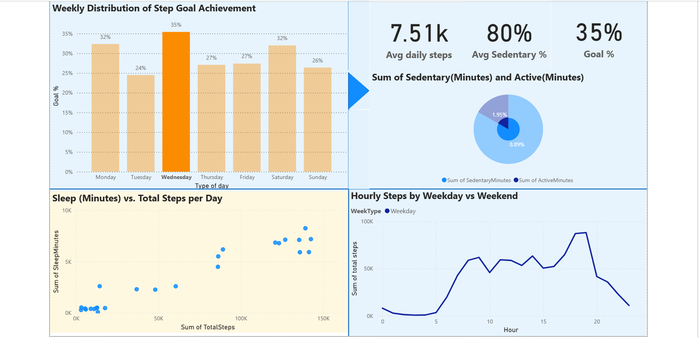
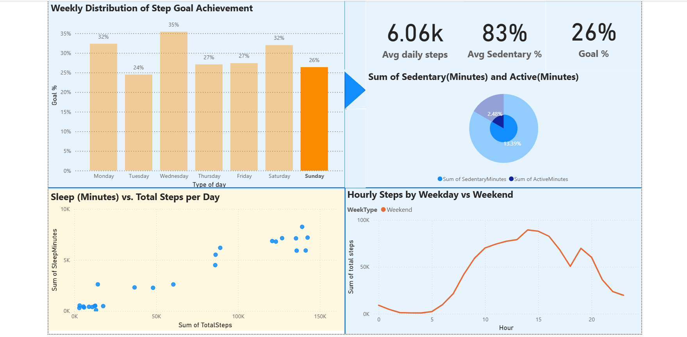
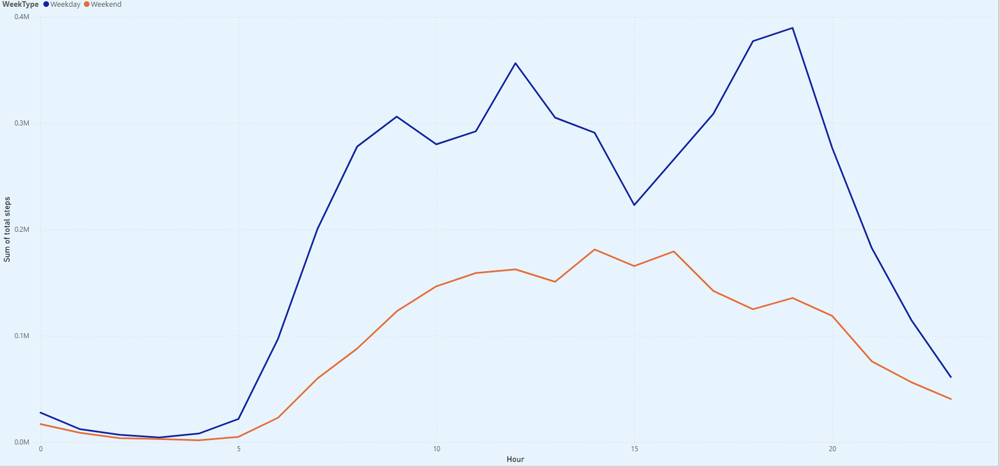

# fitbit-data-analysis-portfolio
Project Background
Bellabeat is a health-focused technology company that designs smart wellness products for women, including activity trackers and a comprehensive wellness app. As Bellabeat seeks to grow in the competitive smart device market, it wants to better understand how people use wearable fitness technology in their daily lives.

This project analyzes publicly available Fitbit data to uncover trends in activity, sleep, and overall smart device usage. The goal is to generate actionable insights that Bellabeat can use to enhance its marketing strategy and further develop products that meet user needs.

**Insights and recommendations are provided on the following key areas:**

- **User Activity Trends:** Evaluation of daily steps, activity intensity, and overall movement patterns among users.
- **Sleep Behavior Analysis:** Assessment of user sleep duration and quality, and its relationship to activity levels.
- **Device Engagement:** Analysis of how consistently users interact with their fitness trackers.
- **Correlation Analysis:** Investigation of the relationships between physical activity, sleep, and calories burned.
- **Marketing Opportunities:** Recommendations for leveraging user behavior insights to inform product messaging and user engagement strategies.

The complete data cleaning, processing, and exploratory analysis workflow is documented in the following Jupyter notebooks:

- [Data Cleaning and Processing](Fitbit_Process_Phase.ipynb)
- [Exploratory Data Analysis](Bellabeat_Fitbit_Analysis.ipynb)

 ## Data Structure & Entity Relationship Diagram (ERD)

The Fitbit dataset is organized into several related tables, each capturing different aspects of user activity, biometrics, and wellness data. The core tables and their relationships are:

- **dailyActivity:** Main table capturing each user’s daily totals for steps, distance, activity intensity, and calories burned.
- **weightLogInfo:** Records of user weights, BMI, and body fat percentages over time.
- **hourlySteps / hourlyCalories / hourlyIntensities:** Hourly summaries of steps, calories burned, and physical activity intensity.
- **heartrate:** Heart rate measurements at specific timestamps for each user.
- **Merged_Sleep_and_Activity:** Combines daily activity data with total daily sleep minutes for each user.

All tables are linked by the `Id` field (the unique user identifier), which enables integrated analysis of activity, sleep, weight, and heart rate patterns.

## Executive Summary

### Overview of Findings

This analysis of Fitbit user data uncovers clear patterns in daily activity, sleep behavior, and device engagement. Most users fall short of recommended activity and sleep levels, with only a minority meeting the benchmark of 10,000 steps per day or 7+ hours of nightly sleep. Strong correlations were observed between consistent activity, longer sleep duration, and overall health indicators such as calories burned and BMI.

Key insights for Bellabeat include:
- **User Activity**: Fewer than 20% of users achieve 10,000 daily steps. Average daily step counts fall below recommended levels, indicating a significant opportunity to motivate users through targeted reminders and challenges.
- **Sleep Trends**: Many users average less than 7 hours of sleep per night. Sleep quality and duration fluctuate widely, with higher activity generally associated with improved sleep.
- **Device Engagement**: Engagement is highest in the first two weeks of use, then gradually declines, suggesting a need for features that sustain user motivation over time.
- **Integrated Health Metrics**: Users who log both activity and sleep tend to have more consistent wellness patterns, highlighting the importance of multi-metric tracking.

Below is an overview from the interactive Power BI dashboard. 

## Insights: Weekday vs. Weekend Activity

### Users Are Most Active on Wednesdays

Looking at the weekly distribution of step goal achievement, users are most active on **Wednesdays**. On this day, the average daily steps reach about **7,510**, and the goal achievement rate peaks at **35%**. This highlights Wednesday as the week’s most active day.

---

### Activity Drops Significantly on Sundays

In contrast, **Sundays** show the lowest activity. Users average only **6,060 steps**, with a goal achievement rate of **26%**. This makes Sunday the least active day of the week according to the data.

### Relationship Between Daily Steps and Sleep

The scatterplot below shows a moderate positive relationship between total daily steps and total sleep minutes. Users who are more active—logging higher step counts—also tend to get more sleep per night. However, most users still fall short of the recommended sleep duration, even as activity increases. This suggests that while being active supports better sleep, there’s still room for improvement in both movement and sleep habits.

  <!-- Replace with your actual file name -->

### Most Users Spend the Majority of Their Day Sedentary

Even on the most active day of the week (Wednesday), Fitbit users spend about **80% of their time being sedentary** and only 20% active. This is shown in both the summary tiles and the pie chart below. Despite higher step counts on this day, the data highlights a significant opportunity to help users incorporate more movement throughout their daily routines.

### Hourly Activity Patterns: Weekday vs. Weekend

The line chart below compares users’ step counts by hour for weekdays (blue) and weekends (orange). On weekdays, activity peaks twice: once in the morning and again in the early evening, likely reflecting commute times and after-work exercise. On weekends, the activity pattern is flatter and overall step counts are lower throughout the day. This suggests that users are more likely to be active during structured workdays than on weekends.

### Weekday vs Weekend: Summary of Activity Patterns

Synthesizing the findings above, the data shows that users are generally **more active on weekdays** than on weekends. Step counts, goal achievement rates, and hourly movement all peak during the structured routines of weekdays. In contrast, activity levels decline on weekends, and sedentary time remains high throughout the week.

These trends suggest that daily routines and external structure help drive healthier habits. Weekends represent a key opportunity for Bellabeat to encourage users to stay active and maintain positive routines, even outside of their normal workweek schedule.

## Problems & Recommendations

### 1. Gamified Rewards for Healthy Habits

**Recommendation:**  
Introduce a gamified rewards system within the Bellabeat app. Encourage users to complete healthy tasks—such as achieving daily step targets, maintaining consistent sleep schedules, or reaching activity streaks—to earn points.  
Points can be redeemed for exclusive in-app rewards (such as wallpapers, badges, or app themes) that cannot be purchased, only unlocked through healthy behavior. This will make healthy routines more engaging and fun, helping users stay motivated and consistent.

---

### 2. Personalized Step Goal Onboarding

**Recommendation:**  
Revamp the onboarding process to suggest a lower, personalized initial step goal (for example, 1,000 or 3,000 steps per day) instead of the standard 10,000. Gradually increase the target as the user shows consistency in reaching their goals. This approach supports early wins and helps users build confidence, increasing their chances of long-term success.

---

### 3. Low Step Goal Achievement

**Problem:**  
The majority of users are not meeting the recommended 10,000 daily steps. Step goal achievement rates range from only 24% to 35% across the week, with the lowest rates on Sundays.

- **S:** Many users do not achieve their daily step goals.
- **M:** Only 24%–35% goal achievement (measured daily, tracked by day).
- **A:** Can be improved with targeted in-app interventions.
- **R:** Directly impacts user health and engagement.
- **T:** Most pronounced on weekends, especially Sundays.

**Recommendation:**  
Implement personalized, time-bound step challenges and reminders—especially for weekends. For example, push notifications on Sunday mornings encouraging users to take a walk or participate in a “Weekend Warrior” challenge could help lift activity on the lowest days.

---

### 4. High Sedentary Time

**Problem:**  
Across all days, users spend about 80%–83% of their time sedentary, indicating a lack of consistent movement.

- **S:** Users are sedentary for the majority of the day.
- **M:** 80%–83% sedentary time, <20% active time.
- **A:** Can be addressed with behavior nudges and app features.
- **R:** Important for reducing health risks and promoting activity.
- **T:** Persistent daily and weekly.

**Recommendation:**  
Introduce “move reminders” and gentle activity prompts within the Bellabeat app to encourage users to break up long periods of inactivity. Smart nudges every hour (or after extended sedentary periods) can help form better habits and lower health risks.

---

### 5. Drop in Activity on Weekends

**Problem:**  
Activity levels and step counts are significantly lower on weekends, with both step counts and goal achievement rates dropping, especially on Sundays.

- **S:** Weekend activity and goal achievement decline.
- **M:** Step counts and goal rates drop on Saturday and Sunday.
- **A:** Targeted weekend programs or social features can address this.
- **R:** Supports overall user retention and consistent engagement.
- **T:** Most pronounced Saturday–Sunday.

**Recommendation:**  
Create weekend-specific challenges (e.g., “Weekend Step-Up”) and social features like group walks or virtual competitions. Reward users for maintaining activity across all seven days, not just weekdays.

---

### 6. Inconsistent Sleep and Activity Patterns

**Problem:**  
While higher step counts are associated with better sleep, most users still fall short of the recommended sleep duration, and the relationship is moderate.

- **S:** Many users don’t get enough sleep, even with more activity.
- **M:** Average sleep duration still below recommended, even for active users.
- **A:** Address with sleep hygiene tips and integrated goal setting.
- **R:** Essential for comprehensive wellness.
- **T:** Daily sleep patterns.

**Recommendation:**  
Integrate sleep coaching within the app, offering personalized bedtime reminders and tips based on daily activity. Encourage users to set both sleep and activity goals, highlighting the health benefits of combining both.

## Caveats & Assumptions

This analysis is based on the Fitbit dataset provided for the Bellabeat case study. While it offers valuable insights into user activity, sleep, and engagement, there are important limitations:

- **Limited Demographic Information:**  
  The data does not include user age, family status, or other demographic segments. As a result, I was unable to analyze how factors such as age or whether a user has children might influence activity or sleep patterns. Segment data would have allowed for more targeted and actionable recommendations, such as tailoring goals by age group or family situation.

- **Missing Behavioral Segments:**  
  Throughout the analysis, I often found myself wishing for deeper user segmentation. With more information about users’ backgrounds and lifestyles, I could have investigated whether younger or older users are more active, or whether family status (e.g., having kids) impacts wellness routines.

- **Data Quality:**  
  The available dataset is relatively small and may not be fully representative of the broader Bellabeat user base. Some days and user records may be incomplete or missing, which can affect the robustness of the findings.

Despite these limitations, the analysis provides useful high-level trends. For future work, having richer demographic and behavioral data would enable deeper and more personalized insights.

